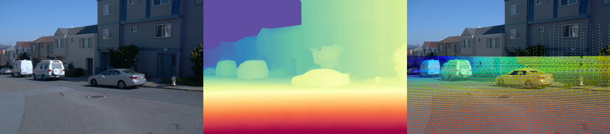

# FreeDrive

## Overview

```
FreeDrive
├── code
│   ├── datasets
│   │   ├── waymo_lidar_to_2d_img.py            # waymo dataset lidar projector tool
│   │   └── waymo_prepare.py                    # waymo dataset processor
│   ├── pointcloud
│   │   ├── depth_anything_3                    # da3 official code
│   │   ├── da3_infer.py                        # get per-frame depth using front 3 cameras 
│   │   ├── point_cloud_painter_prepare.py      # construct train-dataset for PointCloudPainter 
│   │   ├── render_from_npz.py                  # render point cloud video in given camera traj
│   │   └── requiremetns.txt                    # 4090 / 910B environment
│   └── video_painter_infer
│       ├── diffusers
│       ├── example                             # i/o params demo
│       ├── inpaint_custom.py           
│       ├── inpaint_custom.sh                   # bash for customized input
│       └── requirements.txt                    # 4090 environment
└── data
    └── waymo
        ├── raw
        │   └── segment-10061305430875486848_1080_000_1100_000_with_camera_labels.tfrecord
        └── processed
            └── segment-10061305430875486848_1080_000_1100_000_with_camera_labels
                ├── dynamic_masks
                ├── ego_pose
                ├── extrinsics           
                ├── images_clip                 # clip top pixels of FRONT 3 cameras to 1920*886 (Deprecated)
                ├── images_raw
                ├── intrinsics
                ├── lidar_align                 # align depth with real-world scale (Deprecated)    
                └── videos
```

## Data Preprocess

依次处理文件夹下所有tfrecord，取出特定帧
```
conda activate wlh-py
cd /data/wlh/FreeDrive/code/datasets
python waymo_preprocess.py
```

将 LiDAR 投影到 2D 摄像机照片上
```
python lidar_to_2d_image.py
```


## Point Cloud

借 depth anything 3 的深度估计和点云导出 utils，先推理、再对齐、最后导出为 .glb 可以直接双击查看
```
conda activate da3
cd /data/wlh/FreeDrive/code/pointcloud
CUDA_VISIBLE_DEVICES=3 python da3_infer.py
```

还会生成逐帧逐相机的深度图文件 .npz，可通过 render_from_npz.py 执行可视化，效果如下：

<div align="center">
  <table>
    <tr>
      <td align="center"><b>RGB FRONT</b></td>
      <td align="center"><b>Point Cloud FRONT</b></td>
      <td align="center"><b>Point Cloud FRONT (Right+1.5m)</b></td>
    </tr>
    <tr>
      <td></td>
      <td></td>
      <td></td>
    </tr>
  </table>
</div>


## Point Cloud Painter

借 VideoPainter 做的 pipeline。使用时应注意 sh 文件中的各文件、模型路径与prompt。
```
/video_painter_infer/requirements.txt
conda activate videopainter
cd /data/wlh/FreeDrive/code/video_painter_infer
bash inpaint_custom.sh
```

通过先使用数据集前三相机获得的点云获得某新轨迹下的三相机失真点云视频，再使用该失真点云视频获得的点云重新获得原 FRONT 轨迹下的失真点云视频，
并记录 mask，结合数据集中的 FRONT 驾驶视频，就构建出了一个 occlusion/mask/GT 的训练数据。
```
/pointcloud/requirements.txt
conda activate da3
cd /data/wlh/FreeDrive/code/pointcloud
CUDA_VISIBLE_DEVICES=3 python point_cloud_painter_prepare.py
```

<div align="center">
  <table>
    <tr>
      <td align="center"><b>Point Cloud FRONT (Right+1.5m)</b></td>
      <td align="center"><b>Reprojected Point Cloud FRONT</b></td>
      <td align="center"><b>Reprojected Mask FRONT</b></td>
    </tr>
    <tr>
      <td></td>
      <td></td>
      <td></td>
    </tr>
  </table>
</div>


## TODO

- [x] [2025/11/26] DA3 inference with provided camera
- [x] [2025/12/12] WOD tfrecord to images/cam extrinsics scripts
- [x] [2025/12/15] Reload scene from *.npz, get dense point cloud seq, unseen patch seq with given camera
- [x] [2025/12/16] Test VideoPainter with custom mask/rgb video.
- [x] [2025/12/19] Per-frame project with 3 cameras.
- [ ] Construct fine-tune dataset
- [ ] FID/NTA IoU scripts
- [ ] Add reference frame/bbox branch and fine-tune
- [ ] Possibility to change env settings
- [ ] Possibility to DIY cam extrinsics like Gen3C


## Great Thanks

[Open3D PointCloud Viewer](https://salzi.blog/2022/05/14/waymo-open-dataset-open3d-point-cloud-viewer/) for his lidar projector.